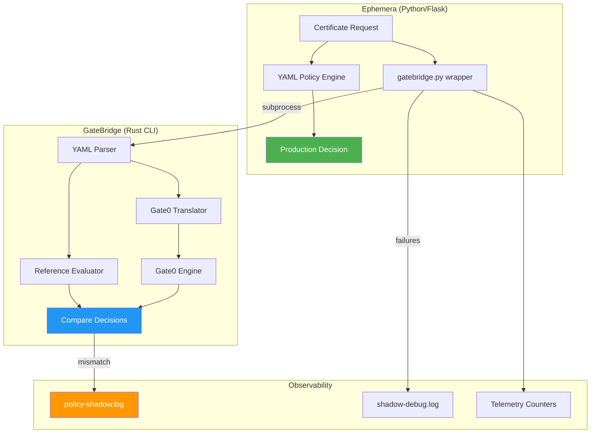

# GateBridge

YAML policy translator and shadow evaluator for [Gate0](https://github.com/Qarait/gate0).

Translates Ephemera-style YAML policies to Gate0's internal representation and provides dual-evaluation for validation.

## Status

**Phase 3 — Proactive Hardening (Complete)**

GateBridge has completed its formal hardening phase. It has been verified against the reference evaluator via **100,000+ differential fuzzing iterations** with zero semantic drift. It is now in **Observation Mode** in the Ephemera production flow.

## Hardening & Verification

GateBridge uses a differential fuzzer to ensure semantic equivalence between its YAML translation layer and the reference legacy evaluator.

- **Domain-Aware Generation**: The fuzzer generates valid CIDRs, email patterns with wildcards, and complex time ranges.
- **Continuous Validation**: Verified via **100,000 soak test iterations** with zero mismatches.
- **Fail-Open Design**: Designed for non-intrusive shadow deployment.

## Installation

```bash
# Clone and build
git clone https://github.com/Qarait/gatebridge.git
cd gatebridge
cargo build --release
```

Binary will be at `target/release/gatebridge`.

## Usage

```bash
# Validate policy syntax
gatebridge validate policy.yaml

# Translate to Gate0
gatebridge translate policy.yaml

# Shadow evaluation (dual execution)
gatebridge shadow policy.yaml request.json

# Differential Fuzzing (Verification Tool)
gatebridge fuzz 10000        # Run 10k iterations
gatebridge fuzz 100000 42    # Run 100k iterations with seed 42
```

### Exit Codes

| Code | Meaning |
|------|---------|
| 0 | Success (shadow: decisions match) |
| 1 | Mismatch (shadow: decisions differ) |
| 2 | Error (parse failure, etc.) |

## Architecture



### Key Design Principles

| Principle | Implementation |
|-----------|----------------|
| **Observational only** | Gate0 never affects production decisions |
| **Fail-open** | CLI failures return None, never block |
| **Crash isolation** | Subprocess boundary prevents propagation |
| **Adapter pattern** | Complex matching (fnmatch, CIDR) pre-computed before Gate0 |

This keeps Gate0 pure (no fnmatch/CIDR in core) while validating semantic equivalence.

## License

MIT
